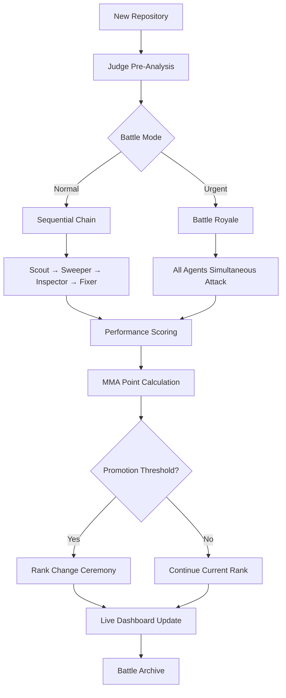

# 🏛️ AI CODE GLADIATOR SYSTEM - PRODUCT REQUIREMENTS DOCUMENT

## 1. Product Overview

The AI Code Gladiator System transforms code review into an entertaining spectator sport through competitive multi-agent analysis, delivering bulletproof code quality via digital warfare between 4 AI gladiators.

- **Core Problem**: Traditional code review is boring, inconsistent, and often misses critical issues due to human fatigue and bias
- **Target Users**: Development teams, GitHub organizations, and code quality enthusiasts who want thorough automated analysis with entertainment value
- **Market Value**: $50B+ code quality market with unique positioning as the first "gamified" enterprise code analysis platform

## 2. Core Features

### 2.1 User Roles

| Role | Registration Method | Core Permissions |
|------|---------------------|------------------|
| System Admin | GitHub OAuth + Admin privileges | Full system control, agent configuration, emergency stop, battle management |
| Repo Owner | GitHub OAuth + Repository access | View battles for owned repos, set urgency levels, approve fixes |
| Developer | GitHub OAuth + Team membership | View analysis results, track personal code quality, spectate battles |
| Spectator | GitHub OAuth (public) | Watch live battles, access leaderboards, participate in prediction games |

### 2.2 Feature Module

Our AI Gladiator System consists of the following essential pages:

1. **Live Battle Arena**: Real-time gladiator competition dashboard with streaming agent thoughts, MMA-style scoring, and battle visualization
2. **Agent Command Center**: Agent management, performance analytics, promotion/demotion tracking, and personality configuration
3. **Repository War Room**: Code analysis results, red/green flagging system, fix implementation status, and quality metrics
4. **Gladiator Leaderboard**: Agent rankings, battle history, championship records, and performance statistics
5. **Battle Control Panel**: Competition settings, judge coordination, emergency controls, and system monitoring

### 2.3 Page Details

| Page Name | Module Name | Feature description |
|-----------|-------------|---------------------|
| Live Battle Arena | Real-time Combat Display | Stream 4 agent thought processes simultaneously via WebSocket, display MMA-style point scoring with visual combat effects, show battle progress with gladiator-themed animations |
| Live Battle Arena | Agent Personality Theater | Individual agent panels with character-driven animations (Scout: desperate, Sweeper: aggressive, Inspector: paranoid, Fixer: dominant), real-time competitive interactions |
| Live Battle Arena | Judge Coordination Hub | Battle royale mode management, file allocation visualization, conflict resolution display, emergency intervention controls |
| Agent Command Center | Performance Dashboard | Win/loss records, promotion/demotion history, point accumulation charts, mistake tracking analytics, agent efficiency metrics |
| Agent Command Center | Agent Configuration | Modify agent personalities, adjust competition parameters, set promotion thresholds, configure safety limits |
| Repository War Room | Analysis Results Display | Code scan findings with syntax highlighting, vulnerability reports, quality metrics, fix recommendations with priority scoring |
| Repository War Room | Red/Green Flag System | Final repository verdicts from Inspector, approval queue for Fixer, fix implementation tracking, quality improvement metrics |
| Gladiator Leaderboard | Rankings & Championships | Current agent hierarchy with Roman numeral rankings, point standings, hall of fame, legendary battle archive |
| Gladiator Leaderboard | Battle History Theater | Epic battle replays with commentary, greatest discoveries showcase, agent rivalry tracking, spectator highlights |
| Battle Control Panel | Competition Management | MMA-style scoring configuration, judge coordination settings, battle mode selection, system health monitoring |

## 3. Core Process

### Normal Mode (Sequential Gladiator Chain)
Repository detected → Judge pre-analysis → Scout reconnaissance → Sweeper validation → Inspector judgment → Fixer implementation → Results celebration

### Urgent Mode (Battle Royale)
Urgent repository flagged → Judge coordination deployment → All 4 agents attack simultaneously → Real-time conflict resolution → Consolidated victory → Promotion/demotion ceremony

### MMA-Style Competition Flow
Agent performance tracking → Point calculation (wins/losses/discoveries) → Threshold evaluation → Promotion/demotion decision → Rank ceremony → Leaderboard update

## 4. User Interface Design

### 4.1 Design Style

- **Primary Colors**: Gladiator Gold (#FFD700), Arena Red (#DC143C), Victory Green (#228B22)
- **Secondary Colors**: Steel Gray (#708090), Battle Blue (#4169E1), Warning Orange (#FF8C00)
- **Button Style**: 3D metallic gladiator shields and weapons with battle-worn textures and hover animations
- **Fonts**: 'Cinzel' for headings (Roman gladiator theme), 'Roboto Mono' for code display, 'Inter' for body text
- **Layout Style**: Roman colosseum-inspired with arena viewing angles, card-based battle panels, marble textures
- **Animation Style**: Combat-inspired transitions, weapon clash effects, victory celebrations, defeat animations
- **Icon Style**: Gladiator weapons (⚔️), shields (🛡️), laurel wreaths (🏆), Roman numerals for rankings

### 4.2 Page Design Overview

| Page Name | Module Name | UI Elements |
|-----------|-------------|-------------|
| Live Battle Arena | Main Combat Theater | Dark arena background with golden spotlights, four gladiator panels with scrolling combat logs, real-time point counters with Roman numerals, battle sound effects and visual combat indicators |
| Live Battle Arena | Agent Battle Stations | Individual colosseum-style containers with agent avatars in gladiator gear, streaming thought bubbles with personality-based colors, combat status indicators (attacking/defending/victorious) |
| Agent Command Center | Performance Colosseum | Marble-textured dashboard with bronze statistics panels, agent portraits in gladiator armor, performance charts with weapon-themed progress bars |
| Repository War Room | Code Analysis Arena | Dark code editor panels with gladiator-themed syntax highlighting, red/green flag banners, fix progress displayed as battle completion meters |
| Gladiator Leaderboard | Hall of Champions | Roman temple-style leaderboard with marble columns, agent rankings displayed on bronze tablets, victory laurels and defeat markers |

### 4.3 Responsiveness

Desktop-first gladiator arena experience with mobile-adaptive battle viewing, touch-optimized spectator controls for tablets, and responsive agent panel layouts that maintain the colosseum aesthetic across all screen sizes.

## 5. Advanced Features

### 5.1 Spectator Entertainment

- **Battle Predictions**: Users can predict which agent will find the most issues
- **Agent Fan Clubs**: Follow favorite agents and receive notifications of their battles
- **Epic Moment Replays**: Automatically capture and replay legendary discoveries
- **Battle Commentary**: AI-generated play-by-play commentary during intense competitions
- **Crowd Participation**: Spectator cheering affects agent morale and performance

### 5.2 Gamification Elements

- **Achievement System**: Unlock badges for agents ("Bug Slayer", "Code Gladiator", "Arena Champion")
- **Seasonal Championships**: Monthly tournaments with special rewards and recognition
- **Legendary Status**: Agents can achieve permanent hall of fame status for exceptional performance
- **Battle Streaks**: Track consecutive victories and create momentum-based bonuses
- **Spectator Rewards**: Points for accurate predictions and active participation

### 5.3 Enterprise Features

- **Custom Agent Training**: Organizations can train agents on their specific coding standards
- **Compliance Reporting**: Generate detailed reports for security and quality audits
- **Integration APIs**: Connect with existing CI/CD pipelines and development tools
- **White-label Options**: Customize branding while maintaining the gladiator theme
- **Multi-tenant Support**: Separate arenas for different teams or organizations

### 5.4 Safety & Control Features

- **Emergency Stop**: Instant halt of all agent activities with one-click override
- **Safe Mode Toggle**: Disable competition for critical repositories requiring stable analysis
- **Human Approval Gates**: Require manual approval for high-risk changes
- **Audit Trail**: Complete logging of all agent decisions and actions
- **Rollback Protection**: Instant reversion capabilities for any problematic changes

## 6. Success Metrics

### 6.1 Code Quality Metrics

- **Bug Detection Rate**: Increase in critical issues found compared to traditional review
- **False Positive Reduction**: Decrease in incorrect flagging through agent competition
- **Fix Implementation Speed**: Time from detection to resolution
- **Code Quality Score**: Overall improvement in repository health metrics

### 6.2 Engagement Metrics

- **Battle Viewership**: Number of active spectators during live competitions
- **Agent Following**: Users tracking specific agent performance
- **Prediction Participation**: Engagement with battle outcome predictions
- **Session Duration**: Time spent watching battles and reviewing results

### 6.3 Business Metrics

- **Repository Coverage**: Percentage of organization's repos under gladiator protection
- **Developer Adoption**: Active users engaging with the system
- **Enterprise Retention**: Long-term usage and renewal rates
- **ROI on Code Quality**: Reduction in production bugs and security incidents

This product transforms the mundane task of code review into an engaging, competitive spectacle while delivering superior code quality through the relentless competition of AI gladiators fighting for digital supremacy.