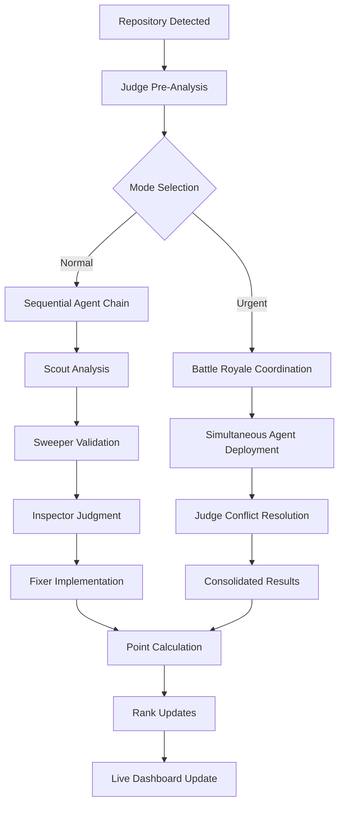
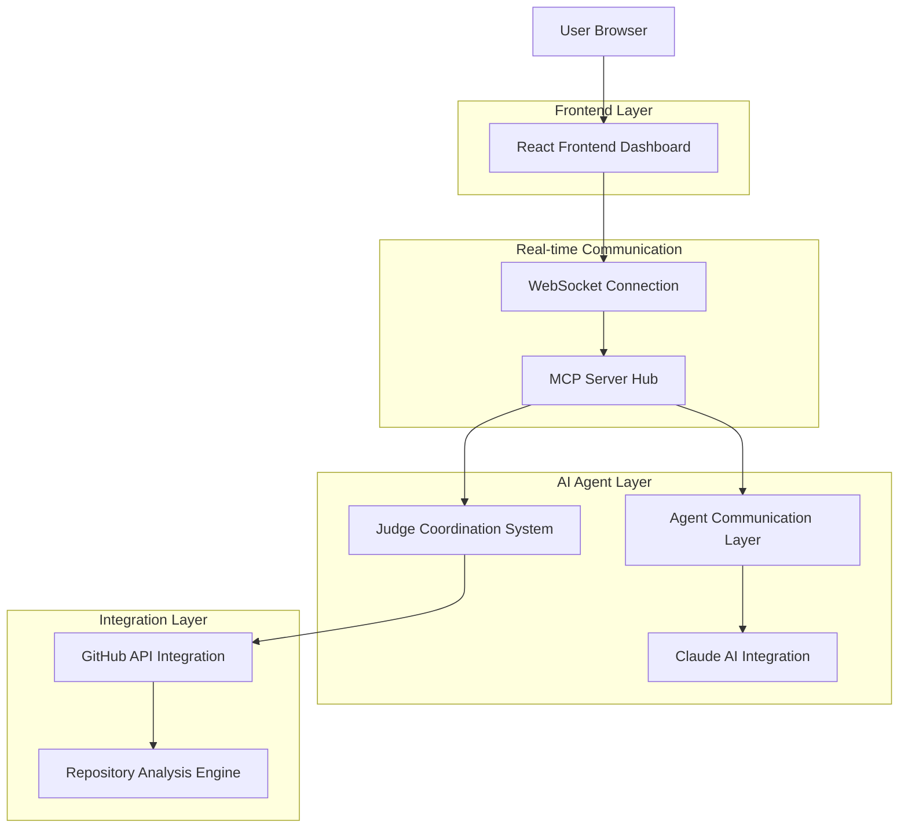

# 🏛️ AI CODE GLADIATOR SYSTEM - TECHNICAL BLUEPRINT

## 1. Product Overview

The AI Code Gladiator System is a competitive multi-agent code analysis platform where 4 AI agents battle in a hierarchical arena, using MMA-style point scoring and real-time streaming to deliver bulletproof code review through digital warfare.

* **Core Purpose**: Transform code review into a spectator sport while achieving maximum code quality through competitive AI analysis

* **Target Market**: Development teams, GitHub organizations, and code quality enthusiasts seeking automated, thorough code analysis with entertainment value

## 2. Core Features

### 2.1 User Roles

| Role         | Registration Method        | Core Permissions                                         |
| ------------ | -------------------------- | -------------------------------------------------------- |
| System Admin | GitHub OAuth + Admin Token | Full system control, agent configuration, emergency stop |
| Repo Owner   | GitHub OAuth               | View battles for owned repos, set urgency levels         |
| Spectator    | GitHub OAuth               | View live battles, access dashboard, betting features    |

### 2.2 Feature Module

Our AI Gladiator System consists of the following main components:

1. **Live Battle Arena**: Real-time agent competition dashboard, streaming thought processes, MMA-style scoring display
2. **Agent Management Console**: Agent configuration, promotion/demotion tracking, performance analytics
3. **Repository Analysis Hub**: Code scanning results, red/green flagging, fix implementation tracking
4. **Competition Dashboard**: Rankings, battle history, point system management, judge coordination
5. **MCP Integration Center**: Agent communication protocols, Claude AI integration, context sharing

### 2.3 Page Details

| Page Name                | Module Name              | Feature description                                                                                                      |
| ------------------------ | ------------------------ | ------------------------------------------------------------------------------------------------------------------------ |
| Live Battle Arena        | Real-time Dashboard      | Stream agent thoughts via WebSocket, display MMA-style point scoring, show battle progress with visual combat indicators |
| Live Battle Arena        | Agent Thought Streams    | Four-panel live streaming of agent analysis, personality-based animations, competitive interaction visualization         |
| Live Battle Arena        | Judge Coordination Panel | Battle royale mode coordination, file allocation management, conflict resolution display                                 |
| Agent Management Console | Agent Configuration      | Modify agent personalities, adjust competition parameters, emergency stop controls                                       |
| Agent Management Console | Performance Analytics    | Win/loss records, promotion/demotion history, mistake tracking, point accumulation charts                                |
| Repository Analysis Hub  | Code Analysis Results    | Display scan findings, vulnerability reports, code quality metrics, fix recommendations                                  |
| Repository Analysis Hub  | Red/Green Flagging       | Final repository verdicts, Inspector decisions, Fixer approval queue                                                     |
| Competition Dashboard    | Rankings & Leaderboard   | Current agent hierarchy, point standings, championship records                                                           |
| Competition Dashboard    | Battle History           | Past competitions, epic battle replays, legendary discoveries archive                                                    |
| MCP Integration Center   | Agent Communication      | Inter-agent messaging logs, context sharing protocols, Claude AI decision tracking                                       |

## 3. Core Process

### Normal Mode Flow (Sequential)

```
New Repository → Judge Pre-Analysis → Agent-1 (Scout) → Agent-2 (Sweeper) → Agent-3 (Inspector) → Agent-4 (Fixer) → Results
```

### Urgent Mode Flow (Battle Royale)

```
Urgent Repository → Judge Coordination → Simultaneous Agent Deployment → Conflict Resolution → Final Verdict
```

### MMA-Style Point System Flow

```
Agent Performance → Point Calculation → Threshold Check → Promotion/Demotion Decision → Rank Update
```



## 4. User Interface Design

### 4.1 Design Style

* **Primary Colors**: Gladiator Gold (#FFD700), Arena Red (#DC143C), Victory Green (#228B22)

* **Secondary Colors**: Steel Gray (#708090), Battle Blue (#4169E1), Warning Orange (#FF8C00)

* **Button Style**: 3D gladiator-themed with metallic textures and battle-worn effects

* **Fonts**: Primary - 'Cinzel' (gladiator theme), Secondary - 'Roboto Mono' (code display)

* **Layout Style**: Arena-inspired with colosseum elements, card-based battle panels

* **Icons**: Gladiator weapons, shields, Roman numerals for rankings, battle emojis

### 4.2 Page Design Overview

| Page Name             | Module Name      | UI Elements                                                                                                                      |
| --------------------- | ---------------- | -------------------------------------------------------------------------------------------------------------------------------- |
| Live Battle Arena     | Main Dashboard   | Dark arena background with golden accents, four agent panels with streaming text, real-time point counters, battle sound effects |
| Live Battle Arena     | Agent Panels     | Individual gladiator-themed containers with agent avatars, scrolling thought streams, combat status indicators                   |
| Competition Dashboard | Rankings Display | Roman colosseum-style leaderboard with marble textures, agent portraits, win/loss statistics                                     |
| Repository Hub        | Analysis Results | Code editor-style panels with syntax highlighting, red/green flag indicators, fix progress bars                                  |

### 4.3 Responsiveness

Desktop-first design with mobile-adaptive battle viewing, touch-optimized spectator controls, and responsive agent panel layouts for various screen sizes.

## 5. Technical Architecture

### 5.1 Architecture Design



### 5.2 Technology Stack

* **Frontend**: React\@18 + TypeScript + TailwindCSS + Framer Motion (animations)

* **Real-time**: WebSocket + Socket.io for live streaming

* **Backend**: Node.js + Express + MCP Protocol Integration

* **AI Integration**: Claude AI via MCP + Custom agent personalities

* **Database**: Supabase (PostgreSQL) for battle history and rankings

* **GitHub Integration**: GitHub API + Webhooks

### 5.3 MCP Integration Architecture

```mermaid
graph TD
    A[MCP Server Hub] --> B[Agent Communication Protocol]
    B --> C[Scout Agent MCP]
    B --> D[Sweeper Agent MCP]
    B --> E[Inspector Agent MCP]
    B --> F[Fixer Agent MCP]
    A --> G[Judge Coordination MCP]
    G --> H[Battle Royale Manager]
    A --> I[Claude AI Integration]
    I --> J[Decision Making Engine]
    A --> K[Context
```

